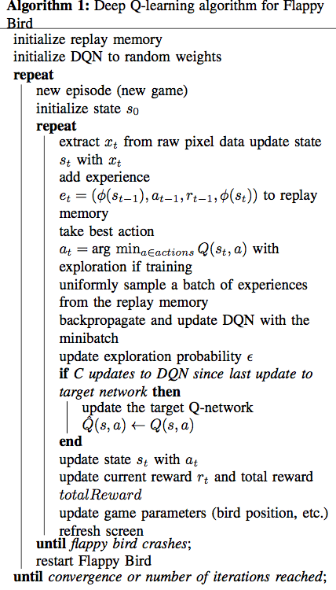

362_report
====

http://cs229.stanford.edu/proj2015/362_report.pdf

# III. METHOD

In this section, we describe how the model is parameterized
and the general algorithm.

## A. MDP Formulation

The actions that the agent can take are to flap (a = 1) or to do nothing and let the bird drop (a = 0). The state is represented by a sequence of frames from the Flappy Bird game as well as the recent actions that the player took. Specifically, the state is the sequence shown in Equation 1 where st is the state at time t, xt is the pixel input (or the frame or screen capture) at time t, and at is the action taken at time t. historyLength (or histLen) is a hyperparameter that specifies how many of the most recent frames to keep track of. This is to reduce the storage and state space compared to saving all frames and actions starting from t = 1. The reason for storing multiple x’s and a’s rather than storing a single frame x is because the agent needs temporal information to play.  For example, the agent cannot deduce the velocity of the bird from a single frame, but velocity is essential for making a decision.

$$
s_t = (x_{t-histLen+1}, a_{t-histLen+1}, ..., x_{t-1}, a_{t-1}, x_t)
$$

智能体能够采取的动作有两种：拍打一下翅膀(a=1)，或者什么都不做从而是小鸟下降(a=0)。状态由FlappyBird游戏产生的一系列像素帧和玩家最近采取的动作表示。明确地来说，状态是公式1所示的序列。其中$s_t$是在时间t的状态，$x_t$在时间t的像素输入（或者帧或者屏幕截图），$a_t$是在时间t采取的动作。historyLength（或者histLen）是一个超参数用来指定保留最近的几帧。相比于保存从t=1开始的所有的帧和动作，这样可以减少存储和状态空间。因为智能体需要时间信息，所以需要保存多个x和a而不是单一x。例如，智能体不能通过一帧图片来推导小鸟的速度，而速度对于决策来说至关重要。

The **discount factor** was set to γ = 0.95. The **transition probabilities** and the **rewards** are unknown to the agent. Since Q-learning is model-free, we do not explicitly estimate the transition probabilities and rewards, but instead directly try to estimate the optimal Q-function. This is described further in the Q-learning section.

折扣系数为$\gamma = 0.95$。转移概率和价值对于智能体来说是未知的。因为Q-learning不依赖于模型，我们不显示地估计转移概率和价值，而直接尝试估计最优的Q函数。在Q-learning节会详细说明这点。

However, we still must define the rewards intrinsic to the game. Ideally, the reward should essentially be the score of the game. It starts out as 0 and every time the bird passes a pipe, the score increases by 1. However, this is potentially problematic in that the rewards will be very sparse. Specifically, if the bird dies instantly at the start of the game, the reward would be similar to if the bird died right before reaching the pipe. The performance is clearly better if the bird survives up until the pipe compared to dying instantly. Therefore, adding a reward for staying alive encourages the agent to think similarly. Without this additional reward, the agent should eventually realize this, but adding the reward, called rewardAlive, speeds up the training process. In total, we have three rewards: rewardAlive, rewardP ipe, and rewardDead. The agent gets rewardAlive for every frame it stays alive, rewardPipe for successfully passing a pipe, and rewardDead for dying.

尽管如此，我们还是必须定义游戏固有的奖励。理想情况下，奖励本质上就是游戏的得分。它从0开始，每次小鸟通过一个管道，这个得分增加1。但是，潜在的问题就是这种奖励太过于稀疏。明确来说就是，如果小鸟在游戏开始就立刻死掉，和小鸟在快靠近管道的地方死掉，奖励是类似的。然而小鸟撑到靠近管道比立刻死掉还是明显要好很多。因此，通过对保持活着给于奖励会鼓励智能体进行类似的思考。如果没有这个多余的奖励，智能体最终还是会意识到这点，但增加这个rewardAlive的奖励，可以加速训练的过程。总的来说，有三种奖励：rewardAlive，rewardPipe和rewardDead。每一帧保持活着就能得到rewardAlive；成功通过一个管道得到rewardPipe，死掉得到rewardDead。

## B. Q-learning

The goal in reinforcement learning is always to maximize the expected value of the total payoff (or expected return). In Q-learning, which is off-policy, we use the Bellman equation as an iterative update

$$
Q_{i+1}(s, a) = \mathbb{E}_{s' \sim \varepsilon} [r + \gamma \max_{a'} Q_i(s', a') | s, a]
$$

where s′ is the next state, r is the reward, ε is the environment, and Qi(s,a) is the Q-function at the ith iteration. It can be shown that this iterative update converges to the optimal Q-function (the Q-function associated with the optimal policy). However, this is rote learning. To prevent rote learning, function approximations are used for the Q-function to allow generalization to unseen states. Our approach uses the deep Q-learning approach in which we use a neural network to approximate the Q-function. This neural network is a convolutional neural network which we call the Deep Q-Network (DQN).

强化学习的目标是始终最大化总报酬的期望值（或期望回报）。在Q-learning中，使用Bellman公式来迭代更新上面那个公式。$s'$是下一个状态，r是奖励，$\varepsilon$是环境，$Q_i(s, a)$是第i次迭代时的Q函数。可以看出，迭代收敛到最优Q函数（与最优策略相关的Q函数）。但这是机械学习，为了防止机械学习，函数逼近被用来泛化到未遇到的状态。我们的方式使用一个神经网络来逼近这个Q函数。这个网络是一个卷积神经网络，我们成为DQN。

A common loss used for training a Q-function approximator is

$$
L_i(\theta_i) = \mathbb{E}_{s, a \sim \rho(.)} \left[ \frac{1}{2} (y_i - Q(s, a; \theta_i))^2 \right]
$$

where θi are the parameters of the Q-network at iteration i and yi is the target at iteration i. The target yi is defined as

$$
y_i = \mathbb{E}_{s' \sim \varepsilon} \left[ r + \gamma \max_{a'} Q(s', a'; \theta_{i-1}) | s, a \right]
$$

for a given experience e = (s, a, r, s′ ). An experience is analogous to a datapoint such as in linear regression and the replay memory, a list of experiences, is analogous to a dataset such as in linear regression. The gradient of the loss function with respect to the weights is shown in equation 2. Thus, we can simply use stochastic gradient descent and backpropagation on the above loss function to update the weights of the network.

$$
\nabla_{\theta_i} L_i(\theta_i) = \mathbb{E}_{s, a \sim \rho(.); s' \sim \varepsilon} \left[ (r + \gamma \max_{a'} Q(s', a'; \theta_{i-1}) - Q(s, a; \theta_i)) \nabla_{\theta_i} Q(s, a; \theta_i) \right]
$$

用来逼近Q函数的常见损失函数是公式4。$\theta_i$是第i次迭代的网络参数。$y_i$是第i次迭代的目标。在给定的经验e下$y_i$的定义是公式5。一个经验类似于线性回归里的数据点。重放记忆是一个经验列表，类似于线性回归中的一个数据集。损失函数的梯度是公式2。因此，利用在这个损失函数上的随机梯度下降和反向传递可以用来更新网络的权重。

Additionally, we take an ε-greedy approach to handle the exploration-exploitation problem in Q-learning. That is, when we are training, we select a random action with probability ε and choose the optimal action aopt = arg maxa′ Q(s, a′ ). In our implementation, we linearly change the exploration probability ε from 1 to 0.1 as the agent trains. This is to encourage a lot of exploration in the beginning where the agent has no idea how to play the game and the state space is extremely large. It takes a large number of random actions and as it starts to figure out which actions are better in different situations/states, it exploits more and tries to narrow down what the optimal actions are.

另外，我们使用了$\epsilon-greedy$方法来处理Q学习中的探索-利用问题。也就是说，在学习时，以概率$\epsilon$选择一个随机动作，否则选择最优的动作 $a_{opt} = arg \max_{a'} Q(s, a')$。在我们的实现中，随着训练进行，线性地将$\epsilon$从1修改到0.1。在游戏开始的时候，智能体对于如何进行游戏没有太多想法的时候，鼓励它进行更多的探索，从而极大地增加状态空间。当采取了大量的随机动作，开始搞明白哪个动作在不同的情况（状态）下更好的时候，它更多的利用价值函数，尝试虽小最优动作的范围。

## C. Experience replay

A problem that arises in traditional Q-learning is that the experiences from consecutive frames of the same episode (a run from start to finish of a single game) are very correlated. This hinders the training process and leads to inefficient training. Therefore, to de-correlate these experiences, we use experience replay. In experience replay, we store an experience (s, a, r, s′ ) at every frame into the replay memory. The replay memory has a certain size and contains the most recent replayMemorySize experiences. It is constantly up- dated (like a queue) so that they are associated with the actions taken with the recent Q-functions. The batch used to update the DQN is composed by uniformly sampling experiences from the replay memory. As a result, our experiences are no longer likely to be correlated.

在传统的Q-learning中有一个问题就是，在同一次游戏周期中连续的帧是非常相关的。这阻碍了训练过程。因此，为了减少这些经验的关联性，我们使用经验重放。我们保存一个经验在每一帧时到重放记忆中。重放记忆有一个固定的大小，包含了最近的replayMemorySize个经验。它持续不断的被更新（类似队列）所以我们和最近采取的动作是相关联的。用来更新DQN的批是重放记忆中通过平均分布采样组成的。这样的结果导致我们的经验不再是相关的了。

## D. Stability

Moreover, to encourage more stability in decreasing the loss function, we use a target network Qˆ(s,a). Qˆ(s, a) is essentially the the same as Q(s, a). The network has the same structure, but the parameters may be different. At every C updates to the DQN Q(s, a), we update Qˆ(s, a). This Qˆ(s, a) is then used for computing the target yi according to:

$$
y_i = \mathbb{E}_{s' \sim \varepsilon} \left[ r + \gamma \max_{a'} \hat{Q}(s,a; \hat{\theta_i} − 1) | s, a \right]
$$

This leads to better stability when updating the DQN.

没看出来Q和Q^的区别。。。

## E. Pre-processing

Since we use a very high dimensional state, we actually perform pre-processing to reduce the dimensionality and state space. The pre-processing is done over the pixels, so we first extract the images from the state st. The original screen size is 512 × 288 pixels in three channels, but we convert the image captured from the screen to grayscale, crop it to 340 × 288 pixels, and downsample it by a factor of 0.3, resulting in a 102×86 pixel image. It is then rescaled to 84 × 84 pixels and normalized from [0, 255] to [0, 1]. I call this feature extractor φ(s).

首先，我们减去状态$s_t$的图片。原始的屏幕尺寸是512x288x3，转成灰度，截取到340x288，以0.3的因子降采样，得到一个102x86的图片。再拉伸到84x84，把[0, 255]标准化到[0, 1]。称这个特征提取器为$\phi(s)$。

## F. Deep Q-Network

Our Q-function is approximated by a convolutional neural network. This network takes as input a 84 × 84 × historyLength image and has a single output for every possible action. The first layer is a convolution layer with 32 filters of size 8 × 8 with stride 4, followed by a rectified nonlinearity. The second layer is also a convolution layer of 64 filters of size 4×4 with stride 2, followed by another rectified linear unit. The third convolution layer has 64 filters of size 3 × 3 with stride 1 followed by a rectified linear unit. Following that is a fully connected layer with 512 outputs, and then the output layer (also fully connected) with a single output for each action. To choose the best action, we take the action with the highest output Q-value (aopt = arg maxa′ Q(s, a′ )).

用convnet逼近Q函数。网络接收输入 84 x 84 x historyLength 的图片，输出代表每个可能动作。第一层32个卷积核，大小8x8，步长4，使用relu激励。第二层64个卷积核，大小4x4，步长2，也是relu。第三层64个卷积核，大小3x3，步长1，relu。再跟一个fc，512个神经元。再就是输出层（fc），对每个动作有一个输出。为了选择最好的动作，我们选择Q价值最高的那个动作（ $a_{opt} = arg \max_{a'} Q(s, a') $）。

## G. Pipeline

The pipeline for the entire DQN training process is shown in Algorithm 1. It is as previously described earlier in this section. We apply Q-learning but use experience replay, storing every experience in the replay memory at every frame. When we perform an update to the DQN, we sample uniformly to get a batch of experiences and use that to update the DQN. This is analogous to sampling batches from a dataset using SGD/mini-batch gradient descent in convolutional neural networks for image classification or deep learning in
general. Then we update the exploration probability as well as the target network Q^(s, a) if necessary.

