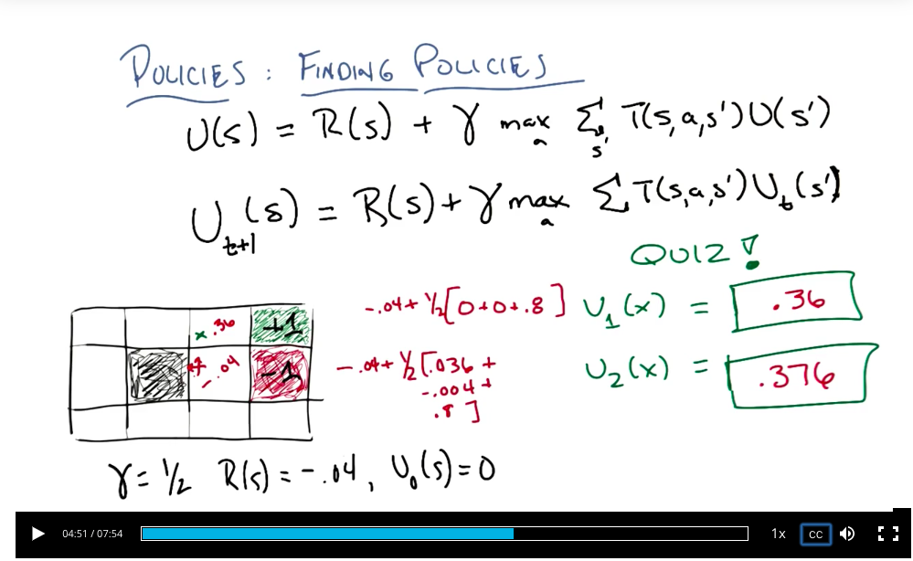

Reinforcement Learning
====

https://cn.udacity.com/course/reinforcement-learning--ud600

Lesson 2
----

supervised learning sort of takes the form of function approximation

Quiz: The World - 2
Quiz Credits: AI: A Modern Approach.
http://aima.cs.berkeley.edu/

state/action

T(s,a,s') ~ Pr(s' | s,a) : the physics of the world, there are the rules of the game in which don't change

markov decision process: 
- only present matters
- stationary

you can turn almost anything, into a Markov process by simply making certain that your current state remembers everything you need to remember from the past.

the world is stationary, the transition model is stationary, the physics are stationary, the rules don't change.

markov defines a problem, a solution to it is called a policy

temporal credit assignment problem

by having a small negative reward everywhere, it encourages you to end the game

about having teachers and learners. You can think of your reward as sort of the teaching signal. Sort of the teacher telling you what you ought to do, and what you ought not to do.

so if you're going to design an MDP to capture some world. Then you want to think carefully about how you set the rewards in order to get the behavior that you wish.

infinite horizons

stationary preferences

existential dilemma of being immortal

discounted rewards, geometric series, infinite => finite

$$
\sum_{t=0}^\infty \gamma^t R(S_t)     (0 \leq \gamma \le 1) \\
\leq \sum_{t=0}^\infty \gamma^t R_{max} = \frac{ R_{max} }{1 - \gamma}
$$

singularity

bellman equation

$$
\pi^*  = argmax_\pi \mathbb{E}[\sum_{t=0}^\infty \gamma^t R(s_t) | \pi] \\
U^\pi(s) = \mathbb{E}[\sum_{t=0}^\infty \gamma^t R(s_t) | \pi, s_0 = s] \\
\pi^*(s) = argmax_a \mathbb{E}_{s'} T(s, a, s') U(s') \\
U(s) = R(s) + \gamma max_a \mathbb{E}_{s'} T(s, a, s') U(s')
$$

what reward gives us is immediate gratification or immediate feedback. but utility gives us long term feedback.

Lesson 3: BURLAP
----

Lesson 4: Basics
----

Lesson 5: 3. TD and Friends
----

Yes, and in fact that was I believe that what Sutton was trying to do. He wanted to make temporal predictions and he wanted to put it into the same kind of algebraic framework that people were familiar with from perceptron learning and from neural net learning.

It says if your learning rate doesn't get smaller over time, then you're never going to convert.

